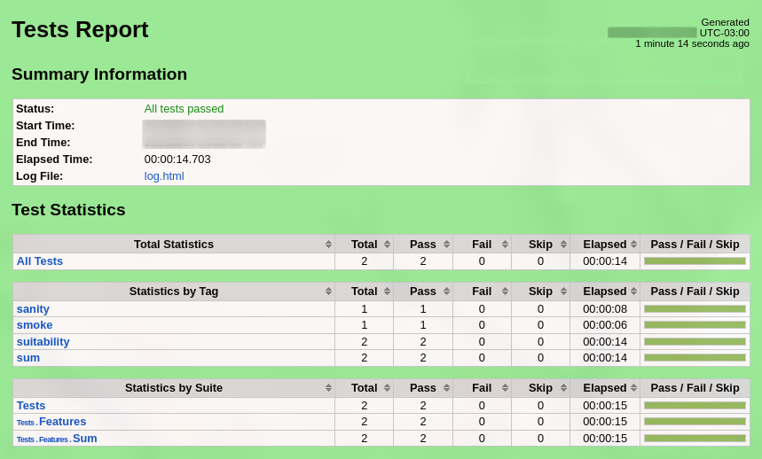

[](https://github.com/prettier/prettier)

# Robotframework Example

Basic example of Robotframework with Python.

# Table of contents

* [Get started](#get-started)
  * [Installation](#installation)
* [How to run the tests](#how-to-run-the-tests)
  * [Running tests](#running-tests)
  * [Running tagged tests](#running-tagged-tests)
* [License](#license)

# Get started

## Installation

```bash
pip install -r requirements.txt
```

# How to run the tests

## Running tests

```bash
bash run.sh
```

```bash
==============================================================================
Tests
==============================================================================
Tests.Features
==============================================================================
Tests.Features.Sum
==============================================================================
Verify the sum of positive values                                     | PASS |
------------------------------------------------------------------------------
Verify the sum of negative values                                     | PASS |
------------------------------------------------------------------------------
Tests.Features.Sum                                                    | PASS |
2 tests, 2 passed, 0 failed
==============================================================================
Tests.Features                                                        | PASS |
2 tests, 2 passed, 0 failed
==============================================================================
Tests                                                                 | PASS |
2 tests, 2 passed, 0 failed
==============================================================================
Output:  /home/.../base-robotframework-python/reports/output.xml
Log:     /home/.../base-robotframework-python/reports/log.html
Report:  /home/.../base-robotframework-python/reports/report.html
```

**HTML report**:



## Running tagged tests

```bash
bash run.sh -i "smoke"
```

# License

[MIT](./LICENSE)
